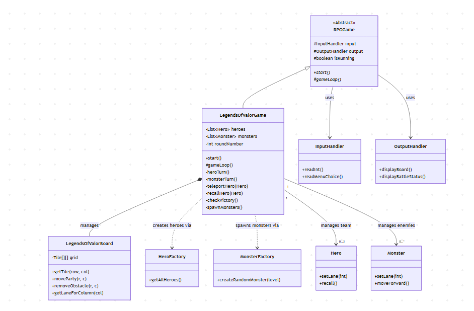

# Design Document: Legends of Valor

- **Name:** Renwei Li / [Teammate's Name]
- **Email:** lir14@bu.edu / [Teammate's Email]
- **Student ID:** U08183479 / [Teammate's ID]

---

## 1. UML Diagrams

### Core Architecture & Inheritance

### System Interaction & Logic

---

## 2. Relationships and Architecture

The arrows and lines in the UML diagrams indicate the following relationships and design choices:

- **GameMenu $\rightarrow$ RPGGame:** The GameMenu acts as the entry point, selecting and launching a concrete game instance via the RPGGame abstraction.
- **LegendsOfValorGame $\rightarrow$ LegendsOfValorBoard:** The game controller manages the state of the world through the board object. The board is responsible for grid management, while the game class handles the logic flow.
- **LegendsOfValorGame $\rightarrow$ Hero/Monster Factories:** The game relies on Factory classes to instantiate entities from data files, decoupling object creation from game logic.
- **Tile $\rightarrow$ Entity Association:** Unlike the previous assignment where the board only held static tiles, Tile objects now maintain lists of Hero and Monster objects. This allows for the persistence of position and multi-entity occupancy .
- **Polymorphism in Tiles:** Specific terrain types (BushTile, CaveTile, KoulouTile) extend the abstract Tile class to implement unique attribute bonuses via the onHeroEnter/Exit methods.

---

## 3. Class Roles

The following are the detailed roles of each class:

### Core Framework (Abstracts & Interfaces)

- **RPGGame.java:** An abstract base class defining the structure of the game loop and I/O initialization. It allows the system to run different RPG modes.
- **Creature.java:** The abstract base class for all living entities, defining shared attributes (HP, Level, Name) and combat behaviors (Attack, Dodge).
- **Item.java:** The abstract base class for all inventory objects, handling price, level requirements, and usage limits.
- **Tile.java:** An abstract class representing a single cell in the world. In _Legends of Valor_, it acts as a container for Heroes and Monsters.
- **Board.java:** An abstract base class providing common grid validation and traversal logic.

### Game Control & I/O

- **LegendsOfValorGame.java:** The concrete controller for the MOBA-style game. It manages:
  - The 3-lane map structure.
  - Round-based logic (Hero turn $\rightarrow$ Monster turn $\rightarrow$ Regeneration).
  - Victory/Defeat conditions (reaching the Nexus).
  - Spawning logic (waves of monsters).
- **InputHandler.java / OutputHandler.java:** Encapsulate all console interactions. This separates the User Interface from the Business Logic, making the code cleaner and easier to maintain.

### Map & Terrain System

- **LegendsOfValorBoard.java:** Extends Board. It generates the specific $8\times8$ map with 3 lanes, inaccessible walls, and Nests.
- **NexusTile.java:** Represents the base for Heroes (market access) and Monsters (spawn point).
- **Buff Tiles (Bush/Cave/Koulou):** Concrete tile implementations that grant temporary stat bonuses (Dexterity, Agility, Strength) to heroes standing on them.
- **ObstacleTile.java:** Represents a temporary wall that can be removed by a hero.

### Entity & Factory System

- **Hero.java:** Abstract parent for specific hero types. It now includes logic for Teleport, Recall, and Lane Assignment.
- **Monster.java:** Abstract parent for monsters. It includes the new AI behavior (moving "forward" towards the hero Nexus).
- **HeroFactory / MonsterFactory / ItemFactory:** These classes implement the Factory Pattern and Singleton Pattern. They parse .txt configuration files to dynamically create game objects, ensuring the game data is easy to modify without recompiling code.

---

## 4. Design Evaluation & Implementation Decisions

### Choice of Implementation: The Hybrid Extension Approach

For _Legends of Valor_, we adopting a hybrid extension approach. The defining features that led us to this decision were:

1.  **Shared Entity Logic:** The core behavior of Hero, Monster, and Item (stats, inventory management, equipment logic) remained 90% identical between the two games.
2.  **Divergent Gameplay Loops:** While the entities are the same, the game flow is fundamentally different. _Monsters and Heroes_ features an exploration loop with random, instigated battle instances. In contrast, _Legends of Valor_ requires a continuous, round-based loop with persistent map positioning, wave spawning, and lane mechanics.

Therefore, we implemented an abstract RPGGame controller and an abstract Board class. This allowed LegendsOfValorGame and LegendsOfValorBoard to implement the complex MOBA-specific logic (lanes, Nexus, spawning waves) without breaking the functionality of the original assignment.

### Evaluation of Architecture

Post-implementation, we believe this architectural decision was correct and successfully achieved our expectations for scalability and maintainability.

- **The Tile System:** We refactored the Tile class to act as a container rather than just a static terrain marker. This decision was crucial for _Legends of Valor_. It allowed us to cleanly implement collision detection and multi-entity occupancy without complex coordinate tracking arrays in the main game class.
- **Polymorphism for Terrain Buffs:** By extending Tile into specific classes like BushTile and KoulouTile with onHeroEnter/Exit, we avoided a monolithic "switch-case" structure in the game loop. This met our expectation of creating a modular system where new terrain types can be added effortlessly.
- **Factory Reusability:** The existing HeroFactory, MonsterFactory, and ItemFactory required almost no modification to support the new game mode, proving that our initial separation of data and logic was robust.

## 5. Scalability

The design supports scalability in several ways:

1. **Data-Driven Design:** New Heroes, Monsters, and Items can be added simply by editing the text files in the "Legends_Monsters_and_Heroes/" directory. The Factories automatically parse and load these new types without requiring code changes.
2. **Dynamic Lane System:** While currently set to 3 lanes, the LegendsOfValorBoard logic calculates lanes based on column indices. This could be scaled to a larger grid (e.g. $10\times10$ with 4 lanes) by adjusting the BOARD_SIZE and wall constants.
3. **Entity Management:** The usage of Hero and Monster in the Game class allows the game to support any number of heroes or monsters, not just the standard 3v3 format.

---

## 6. Extendibility

1. **Tile Polymorphism:** The Tile system is highly extensible. Adding a new terrain type (e.g., "LavaTile" that deals damage) only requires creating a new subclass of Tile and implementing the onHeroEnter method. The Board logic treats all tiles uniformly.
2. **Modular Actions:** Hero actions (Attack, Spell, Potion) are modular. Adding a new action would only require adding a method to the Hero class and an option in the LegendsOfValorGame menu loop.
3. **Game Modes:** Because "LegendsOfValorGame" extends RPGGame, we can easily add a third game mode by creating a new subclass and adding it to the "GameMenu", preserving the Open/Closed Principle.

---
